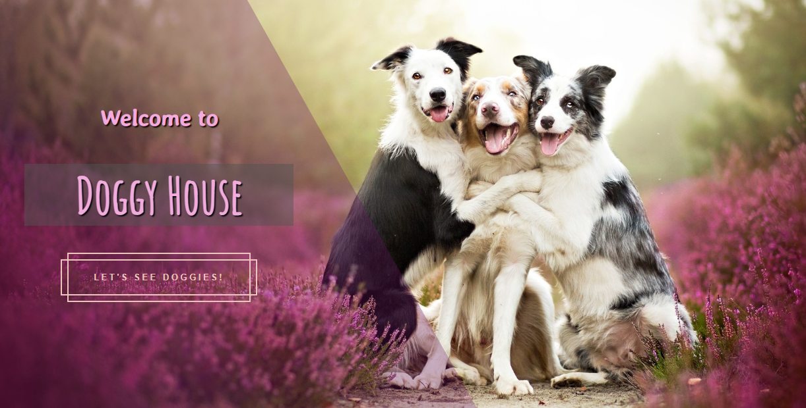

    

# Individual Project - Henry Dogs

  

  

  

    <a  title="Deploy" href="https://doggy-kq5sduqbt-laura-lamprea.vercel.app" target="_blank" rel="noreferrer" >
      <h1>Check it out!</h1>
    </a>
  

## Statement
Doggy House is an application in which you can see the different breeds available along with relevant information about them using the [the dog api](https://thedogapi.com) external api and from it you can, among other things:

  - Add new breeds
  - Filter or Sort
  - Search 

#### Technologies:
- [ ] React
- [ ] Redux
- [ ] Express
- [ ] Sequelize - Postgres

#### Frontend

The React/Redux app contains the following routes:

__Landing page__: 
- [ ] Button to enter the home ( `Main Path` )

__Home__: 
- [ ] Search input to find breeds by name
- [ ] Area where the list of breeds is with their information such as:
  - Name
  - Image
  - Weight
  - Height
  - temperaments
- [ ] Options to filter by temperaments and by existing or created breeds
- [ ] Options to sort both ascending and descending breeds by alphabetical order and by weight
- [ ] Paging to search and display the following breeds, 8 games per page, showing the first 8 on the first page.

__Breed detail__:
- [ ] Name
- [ ] Life
- [ ] Weight
- [ ] Height
- [ ] Temperaments
- [ ] Description

__Breed Creation__: 
- A form __JavaScript controlled__ with:
- [ ] Height (Differentiate between minimum and maximum height)
- [ ] Weight (Differentiate between minimum and maximum weight)
- [ ] Ability to select/add multiple temperaments
- [ ] Button/Option to create a new breeds

#### Database

The database model with Postgres and Sequelize and has the following entities:
- [ ] Breeds
- [ ] Temperaments

The relationship between both entities is many-to-many since a dog breed can have several "temperaments" simultaneously and, in turn, a "temperament" can correspond to multiple different dog breeds.

#### Backend

A server was developed in Node/Express with the following routes:
- [ ] __GET /dogs__:
  - Get a list of dog breeds
- [ ] __GET /dogs?name="..."__:
  - Get a list of dog breeds that contain the word entered as a query parameter
  - If there is no breed of dog, show an appropriate message
- [ ] __GET /dogs/{idRaza}__:
  - Get the detail of a particular dog breed
  - You must bring only the data requested in the dog breed detail route
  - Include associated temperaments
- [ ] __GET /temperament__:
  - Get all possible temperaments
  - In the first instance they must obtain them from the external API and save them in their own database and then use them from there
- [ ] __POST /dog__:
  - Receive the data collected from the controlled form of the dog breed creation route by body
  - Create a dog breed in the database

